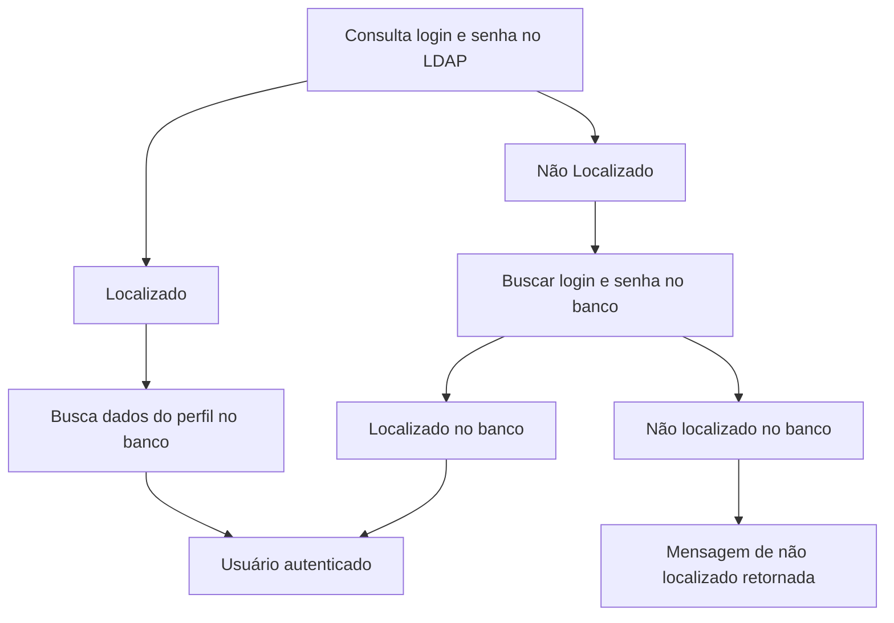
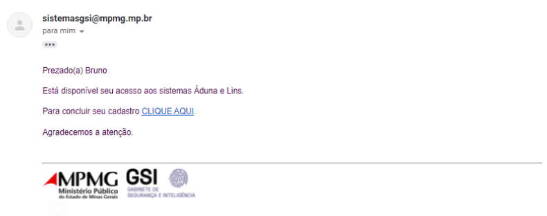
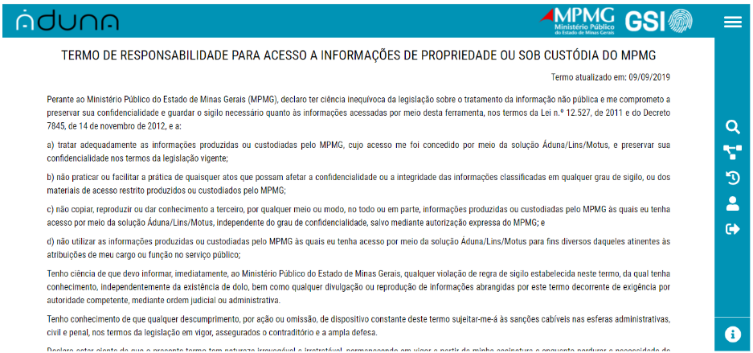

# Sistemas GSI

O projeto Sistemas GSI trata de um conjunto de ferramentas de _Big Data_ para consulta e análise de dados pelo Ministério Público de Minas Gerais e parceiros. Atualmente ele é composto pelos módulos: Áduna e Lins.  
O Áduna é uma plataforma de _Big Data_ desenvolvida para armazenamento, consulta e análise de dados de pessoas físicas e jurídicas.  
O Lins é uma plataforma para análise, controle e fiscalização do patrimônio e contas públicas.

    
    &nbsp;&nbsp;&nbsp;&nbsp;&nbsp;&nbsp;&nbsp;&nbsp;&nbsp;&nbsp;
    
&nbsp;&nbsp;&nbsp;&nbsp;&nbsp;&nbsp;&nbsp;&nbsp;&nbsp;&nbsp;

## Sumário

- [Links de Acesso](#links-de-acesso)
- [Requisitos Mínimos](#requisitos-mínimos)
- [Acesso](#acesso)
- <a href="https://gitlab.com/4mti_solucoes/consulta_gsi/-/blob/homologacao/documentacao/enderecosServidores.md">Endereços Servidores</a>
- <a href="https://gitlab.com/4mti_solucoes/consulta_gsi/-/blob/homologacao/documentacao/desenvolvimento.md">Ambiente de Desenvolvimento</a>
- <a href="https://gitlab.com/4mti_solucoes/consulta_gsi/-/blob/homologacao/documentacao/cargaGSI.md">Carga GSI</a>
- <a href="https://gitlab.com/4mti_solucoes/consulta_gsi/-/blob/homologacao/documentacao/ConsultaGSI.md">Consultas GSI</a>
- <a href="https://gitlab.com/4mti_solucoes/consulta_gsi/-/blob/homologacao/documentacao/testeAduna.md">Teste Geral Áduna</a>
- <a href="https://gitlab.com/4mti_solucoes/consulta_gsi/-/blob/homologacao/documentacao/testeLins.md">Teste Geral Lins</a>
- <a href="https://gitlab.com/4mti_solucoes/consulta_gsi/-/blob/homologacao/documentacao/contigencia.md">Plano de Contigência</a>
- <a href="https://gitlab.com/4mti_solucoes/consulta_gsi/-/blob/homologacao/documentacao/depuracao.md">Depuração</a>
- <a href="https://gitlab.com/4mti_solucoes/consulta_gsi/-/blob/homologacao/documentacao/integracaoContinua.md">Integração contínua</a>
- <a href="https://gitlab.com/4mti_solucoes/consulta_gsi/-/blob/homologacao/documentacaoSistemasGSI.pdf">Documentação Completa</a>

## Links de Acesso

O sistema pode ser acessado em produção nos seguintes endereços:

- <a target="_blank">https://sistemasgsi.mpmg.mp.br/</a>
- <a target="_blank">https://aduna.mpmg.mp.br/</a>
- <a target="_blank">https://lins.mpmg.mp.br/</a>

Em homologação no endereço:

- <a target="_blank">http://sistemasgsi-des.mpmg.mp.br/</a>

## Manual de operação

Acesse o manual de operação neste [link](https://docs.google.com/document/d/1i1Q-bszGbPQqbncjBzShrW-aIB3h94JW1qpgqH8CtKA/edit?usp=sharing).

## Requisitos Mínimos

Requisitos de Sistema operacional.

- Windows 7 ou mais recente
- Linux  Ubuntu 18.04+ de 64 bits, Debian 10+, openSUSE 15.2+ ou Fedora Linux 32+
- Mac OS X El Capitan 10.11 ou mais recente

Hardware

- Processador intel Pentium 4 ou superior compatível com SSE3
- Memoria Ram: 4GB ou superior

Acesso a rede

- Conexão de internet velocidade de 5 Mbit ou 800kbps ou superior.

Navegador Web

- Mozilla Firefox (versão 58 ou superior)
- Chrome (versão 67 ou superior)
- Safari (verão 11.1 ou superior)

## Requisitos Funcionais

    [RAD01]: Entrada e dados por conta do usuário. 
    A solução deverá permitir a entrada de dados por parte dos usuários para completar os cadastros existentes. Os dados deverão ser devidamente catalogados e salvos no banco de dados, sendo mantida sua rastreabilidade.

    [RAD03]: Seleção prévia dos registros. 
    Permitir a seleção prévia dos registros a serem encaminhados para a visualização da análise de vínculos.

    [RG06]: Canal de comunicação. 
    O sistema deve disponibilizar um canal de comunicação com os usuários cadastrados, permitindo o encaminhado de mensagens (via e-mail, por exemplo), segmentadas por instituição, por perfil, dentre outros.

    [RG09]: Criação de um módulo administrativo. 

    [RS01]: Acesso limitado a usuários. 
    O acesso ao sistema deverá ser limitado a usuários previamente cadastrados que estejam autenticados por meio de login e senha, permitindo ao usuário alterar alguns de seus dados cadastrais quando necessário.

    [RS02]: Criação de perfis de acesso deve ser feita de forma parametrizável. 
    O sistema deverá prover segurança e controle de acesso de usuários por meio de perfis para cada uma das funcionalidades da solução. A criação de perfis de acesso deve ser feita de forma parametrizável, com permissões podendo ser determinadas, para cada instituição usuária, em nível horizontal (acessar ou não determinadas entidades) ou vertical (acessar ou não determinados registros/tipos de registros).

    [RS03]: Autenticação e autorização do usuário através do mecanismo institucional. 
    O sistema deverá permitir a autenticação e autorização do usuário através do mecanismo institucional utilizado pelo MPMG e/ou daqueles utilizados pelas instituições parceiras do MPMG, incluindo a possibilidade de utilização de autenticação federada. Atividade de segurança: evolução do mecanismo de autenticação e autorização do Aduna/Lins/Sistemas GSI para uso do WSO2 IS (autenticação federada) e do módulo de autenticação de 2 fatores desenvolvido pelo grupo A04/UFMG 2020.

    [RS04]: Definição das permissões. 
    O sistema deverá permitir a definição das permissões de visibilidade de informações com base em requisitos definidos, possibilitando ainda a parametrização e a criação de exceções para acesso a informações colaterais.

### Áduna

    [RAD07]: Visualização de informações não estruturadas. 
    Permitir a visualização de informações não estruturadas no detalhamento de pessoas físicas e jurídicas, tais como fotos, mapas, dados de redes sociais, dentre outras.

    [RAD08]: Nova pesquisa diretamente do detalhamento. 
    Possibilitar nova pesquisa diretamente do detalhamento de pessoas físicas e jurídicas, através de links em campos chaves como nome da mãe, do pai, dentre outros.

    [RAD09]: Disponibilizar o recurso de paginação dos resultados. 
    No detalhamento de pessoas físicas e jurídicas, disponibilizar o recurso de paginação dos resultados presentes em tabelas que poderão conter dezenas de registros, como, por exemplo, a lista de filiais e funcionários de empresas.

    [RAD10]: Permitir ao usuário escolher versão dos dados a ser apresentada. 
    No detalhamento de pessoas físicas e jurídicas, permitir ao usuário escolher a versão dos dados a ser apresentada, sendo possível a escolha dos dados atuais ou de dados históricos.

    [RAD11]: Salvar análise de vínculos. 
    Na análise de vínculos, possibilitar ao usuário salvar o resultado do trabalho realizado para posterior continuidade.

    [RAD16]: Organização automática análise de vínculos. 
    Na análise de vínculos, implementar algoritmo(s) para permitir a organização automática das entidades apresentadas e permitir ao usuário executá-lo quando necessário.

    [RAD12]: Menu de navegação. 
    Implementar o menu de navegação para cada tópico disponível no detalhamento de pessoas físicas e jurídicas.

    [RAD13]: Relatório de inteligência. 
    Evolução, para os padrões determinados pelo MPMG, do relatório de inteligência apresentado no detalhamento de pessoas físicas e jurídicas.

    [RAD14]: Visualização de vínculos de parentesco. 
    Permitir a visualização de vínculos de parentesco na ferramenta tanto no detalhamento de dados de pessoas físicas e jurídicas quanto na análise de vínculos.

    [RAD17]: Permitir aos usuários selecionar os tipos de entidades. 
    Na análise de vínculos, permitir aos usuários selecionar os tipos de entidades a serem apresentados e a quantidade máxima de registros de cada uma delas, como, por exemplo, sócios, funcionários, endereços, e-mails, dentre outras.

    [RAD18]: Destacar características das entidades. 
    Na análise de vínculos, permitir destacar características das entidades (empresas que estão inativas, por exemplo) e também customizar os ícones a elas relacionados.

    [RAD19]: Mostrar a direção das ligações entre as entidades. 
    Deve ser demonstrada, na análise de vínculos, a direção da ligação entre as entidades, quando couber.

    RAD21]: Pesquisa de Veículos. 
    Disponibilização de módulo de pesquisa de veículos, permitindo, no mínimo, a consulta de dados por meio da placa, em sua totalidade ou parcialmente.

    [RG07.2]: Automatização dos índices a serem considerados na análise de vínculos. 

### Lins

    [RAD05]: Visualização de credores. 
    Implementar a visualização dos credores em mapa de forma georreferenciada.

    [RAD10]: Informações referentes às despesas com servidores públicos. 
    Disponibilizar informações referentes às despesas com servidores públicos, incluindo prefeitos, vereadores, funcionalismo público municipal e estadual.

    [RAD11]: Trilhas referente a folha de pagamento. 
    Implementar trilhas de auditoria referentes a análise da folha de pagamento do funcionalismo público, demonstrando a evolução histórica da folha, permitindo comparar os gastos de diferentes entes públicos e, quando disponível, apresentar o resultado da execução das trilhas que demonstrem a proporção entre os gastos com funcionalismo e as contratações externas efetuadas, o cálculo do limite prudencial de gastos com servidores públicos e a existência de servidores com múltiplos e incompatíveis vínculos.

    [RAD12]: Indicador de atualização monetária. 
    Disponibilizar a possibilidade de se utilizar indicador(es) para atualização monetária dos valores nominais no histórico da evolução das despesas públicas

    [RAD15]: Resultados Georreferenciados. 
    Implementar a visualização dos resultados da pesquisa de forma georreferenciada em mapa, permitindo a seleção prévia dos registros a serem encaminhados.[RAD22]: Módulo de textos não estruturados. Disponibilização de módulo de pesquisa em textos não estruturados, permitindo a consulta de texto livre e apresentando os resultados encontrados, inclusive com possibilidade de vinculação ao documento original.

    [RAD32]: Implementar a consulta em tempo real de fontes de dados obtidos através de convênios MPMG.
    Implementar a consulta em tempo real de fontes de dados obtidas através de convênios firmados pelo MPMG, disponibilizadas pelo MPMG e/ou na internet.

    [RAR05]: Apresentar mais detalhes nos dados de receitas públicas. 
    Evoluir a solução para apresentar mais detalhes sobre os dados das receitas públicas.

    [RLI02.2]: Criação do módulo de contratos. 
    A solução deve abranger a CRIAÇÃO DO MÓDULO DE CONTRATOS, incluindo, no caso dos municípios de Minas Gerais, a carga de dados dos contratos a partir do SICOM.

    [RLI03]: Criação do módulo de notas fiscais (Interface). 
    A solução deve abranger a CRIAÇÃO DO MÓDULO DE NOTAS FISCAIS,

    [RTA01]: Evolução do módulo trilhas. 
    Evolução do módulo de trilhas para permitir automação na criação e/ou execução das trilhas de auditoria, sendo facultada a integração com outras soluções/tecnologias adotadas pelo MPMG.

    [RTA02]: Implementação de trilha. 
    Implementar trilha de auditoria que estabeleça relações entre despesas, licitações e contratos públicos e as respectivas notas fiscais emitidas em favor de entes públicos com o objetivo de identificar fraudes.

    [RTA03]: Trilha de relação entre doadores. 
    Implementar trilha de auditoria que estabeleça eventuais relações entre doadores de campanhas eleitorais e posteriores contratações pelo poder público.

    [RTA05]: Trilha de cruzamento de dados de notas fiscais. 
    Implementar trilha de auditoria que estabeleça, no caso dos municípios de Minas Gerais, o cruzamento das notas fiscais presentes nas prestações de contas do SICOM com aquelas disponibilizadas pela Secretaria da Fazenda.

## Acesso

Para acessar o Sistemas GSI, entre em um dos links informados em [Links de Acesso](#links-de-acesso).  
Na página inicial do sistema (Figura 2) o usuário deve realizar o seu login.

  
_Figura 2: Tela de login do sistema para o link https://sistemasgsi.mpmg.mp.br/_

A autenticação de usuários no Sistemas GSI é feita por meio de chamada API, que segue uma sequência de passos a garantir se o usuário está ou não habilitado para acessar o sistema.

O sistema valida o acesso se valendo de duas formas, LDAP (Lightweight Directory Access Protocol), ferramenta de gerenciamento de credenciais do Windows utilizada pelo MPMG e cadastro no banco de dados PostgreSQL para demais usuários, onde as credencias são armazenadas encriptadas pelo algoritmo SHA-1 de 160 bits.  
O primeiro passo: Para os usuários já cadastrados nos sistemas corporativos do MPMG, o acesso é feito com suas credenciais deste. No primeiro acesso, uma entrada na tabela aduna_oltp.usuario será criada com suas credenciais do LDAP. Para os demais usuários, o nome de usuário ou ou email e senha do PostgreSQL deverão ser inseridos.  
O segundo passo: Os dados de acesso são consultado no banco de dados do PostgreSQL, utilizando a tabela aduna_oltp.usuario. Caso o usuário não tenha cadastro, a mensagem de não localizado será retornada.  
Validado o acesso, o sistema verifica se o usuário já confirmou o aceite ao termo de responsabilidade, consultando a tabela aduna_oltp.termo_responsabilidade do PostgreSQL. Caso não tenha ainda aceito, ao se autenticar, ele será redirecionado para a página do termo de responsabilidade, conseguindo navegar nas demais páginas apenas após o aceite.  
O fluxo de validação desta rotina pode ser visto abaixo.  
O diretório onde a rotina de autenticação está localizada é `/var/www/html/consultas_gsi/src/controller/controllerAduna.js`. O método de interesse chama-se logar.

> Obs.: Caso você não possua o cadastro, este deve ser solicitado à algum administrador do sistema.

Os usuário deverão estar previamente associados a um perfil e a um pacote de fontes.  
Ao realizar o login, o usuário será redirecionado para a página de seleção do módulo, como mostra a Figura 3.  
  
_Figura 3: Tela de seleção de sistema_

Todos os eventos relacionados a autenticação estão disponíveis na tela de Logs do Sistema. Existem 5 tipos de acesso, eles são:

- LOGIN: Ao realizar autenticação bem-sucedida;
- LOGOUT: Ao encerrar a sua sessão;
- TENTATIVA DE LOGIN: Ao realizar autenticação mal-sucedida, quaisquer sejam os motivos;
- ACESSO: Ao realizar qualquer consulta bem-sucedida no Áduna ou Lins;
- ERRO: Ao realizar qualquer consulta mal-sucedida no Áduna ou Lins.

### Fluxo de Validação do Login

As informações do LPAD estão descritas no arquivo .env do projeto.

## Plano de Contingência

As possíveis situações de emergência a serem prevenidas consistem em:

**Falta de espaço em disco ou falta de memória no servidor:** Em caso de falta de espaço em disco ou falta de memória no servidor é necessário entrar em contato com responsável pela infraestrutura dos servidores para que seja liberado mais espaço em disco ou mais memória.

**Erros ou interrupções que possam finalizar de maneira inesperada o processo do sistema:** O servidor de produção que hospeda os sistemas Áduna e Lins contém um serviço que é inicializado de maneira automática. O serviço sistemasgsi.service , que se localiza na pasta /etc/systemd/system/ , possui configurações de reinicialização em caso de falhas do servidor ou sistema operacional, como por exemplo:

- Interrupção inesperada do sistema devido a processos de terceiros (Unclean exit code);
- Sinal de interrupção recebido inesperadamente pelo sistema operacional ou processos de terceiros (Unclean signal);**
- Tempo limite do processo esgotado (Timeout);

**Reinicialização de maneira inesperada do servidor ou queda de energia:** Na reinicialização ou queda de energia do servidor, o serviço sistemasgsi.service é inicializado de maneira automática pelo sistema operacional.

**Intervenções humanas que possam provocar falhas no servidor ou nos sistemas:** Em caso de intervenções que causam reinicialização do servidor, o serviço sistemasgsi.service é inicializado de maneira automática pelo sistema operacional. Em caso de intervenções que impossibilitam a continuidade ou inicialização do serviço sistemasgsi.service é necessário entrar em contato com a área técnica.

Em caso de intervenções que finalizam o serviço sistemasgsi.service é necessário realizar os seguintes comandos dentro do servidor de produção (nodejs-prod1.mpmg.mp.br):

    $ service sistemasgsi restart

E para conferir se o serviço está ativo:

    $ service sistemasgsi status

### BACKUP

A produção dos Sistemas GSI é feita utilizando a plataforma Git, que possui soluções intuitivas e assertivas para salvar todo o progresso dos códigos e repositórios desenvolvidos. O backup do restante dos dados e informações necessárias para as análises dos sistemas é de responsabilidade da contratante.

### COMUNICAÇÃO

QUEM DEVE COMUNICAR
Qualquer servidor que detecte qualquer tipo de problema ou anomalia referente aos sistemas GSI.

A QUEM COMUNICAR
Em caso de falha, é necessário comunicar a equipe de helpdesk do Gabinete de Segurança e Inteligência (GSI), presente no Ministério Público do Estado de Minas Gerais, através dos seguintes contatos:

E-mail: sistemasgsi@mpmg.mp.br 

Em caso de falhas irrecuperáveis, a responsabilidade de garantir a manutenção dos sistemas é da empresa 4MTI Soluções LTDA.

E-mail: 4mti@4mti.com.br
Telefone: (31) 2526-4684

## POLÍTICA DE CRIAÇÃO DE USUÁRIOS

### PERFIS DE USUÁRIOS

Para utilização dos Sistemas GSI, foram criados 9 perfis, com diferentes níveis de acesso. São eles:

    Full Administrador
    Desenvolvimento 
    Helpdesk
    Padrão Aduna	
    Full Aduna
    Aduna Light	
    Padrão Lins	
    Full Lins		
    Padrão Aduna e Lins			
    Padrão Aduna e Lins +

Nos tópicos seguintes, serão discorridos, para cada tipo de perfil, os recursos disponibilizados na plataforma.

Full Administrador

    Estatísticas De Consulta - Administrativo
    Gestão De Índices - Administrativo
    Gestão De Usuários - Administrativo
    Logs De Carga - Administrativo
    Logs Do Sistema - Administrativo
    Origens Dos Dados - Administrativo
    Pacotes De Origens De Dados - Administrativo
    Recursos - Administrativo
    Recursos E Perfis De Acesso - Administrativo
    Sessões Ativas - Administrativo
    Análises De Vínculos - Áduna
    Busca Pessoa - Áduna
    Grafo - Áduna
    Histórico - Áduna
    Imprimir - Áduna
    Contratos - Lins
    Análise de Contratos - Lins
    Classificação de Contratos - Lins
    Despesa - Lins
    Análise de Despesa - Lins
    Classificação de Despesa - Lins
    Comparação de Despesa - Lins
    Credores de Despesa - Lins
    Histórico de Despesa - Lins
    Grafo Lins - Lins
    Licitação - Lins
    Análise de Licitação - Lins
    Sucesso de Licitação - Lins
    Notas Fiscais - Lins
    Análise de Notas Fiscais - Lins
    Classificação de Notas Fiscais - Lins
    Perfil - Lins
    Receita - Lins
    Análise de Receita - Lins
    Classificação de Receita - Lins
    Comparação de Receita - Lins

Desenvolvimento

    Estatísticas De Consulta - Administrativo
    Gestão De Índices - Administrativo
    Gestão De Usuários - Administrativo
    Logs De Carga - Administrativo
    Logs Do Sistema - Administrativo
    Origens Dos Dados - Administrativo
    Pacotes De Origens De Dados - Administrativo
    Recursos E Perfis De Acesso - Administrativo
    Busca Pessoa - Áduna
    Grafo - Áduna
    Histórico - Áduna
    Imprimir - Áduna
    Contratos - Lins
    Análise de Contratos - Lins
    Classificação de Contratos - Lins
    Despesa - Lins
    Análise de Despesa - Lins
    Classificação de Despesa - Lins
    Comparação de Despesa - Lins
    Credores de Despesa - Lins
    Histórico de Despesa - Lins
    Grafo Lins - Lins
    Licitação - Lins
    Análise de Licitação - Lins
    Sucesso de Licitação - Lins
    Perfil - Lins
    Receita - Lins
    Análise de Receita - Lins
    Classificação de Receita - Lins
    Receita Comparação - Lins

Helpdesk

    Gestão De Índices - Administrativo
    Gestão De Usuários - Administrativo
    Logs De Carga - Administrativo
    Logs Do Sistema - Administrativo
    Busca Pessoa - Áduna
    Grafo - Áduna
    Histórico - Áduna
    Imprimir - Áduna
    Despesa - Lins
    Análise de Despesa - Lins
    Classificação de Despesa - Lins
    Comparação de Despesa - Lins
    Credores de Despesa - Lins
    Histórico de Despesa - Lins
    Licitação - Lins
    Análise de Licitação - Lins
    Sucesso de Licitação - Lins
    Receita - Lins
    Análise de Receita - Lins
    Classificação de Receita - Lins
    Receita Comparação - Lins

Padrão Áduna

    Busca Pessoa - Áduna
    Grafo - Áduna
    Imprimir - Áduna

Full Áduna

    Análises De Vínculos - Áduna
    Busca Pessoa - Áduna
    Grafo - Áduna
    Imprimir - Áduna

Padrão Lins

    Despesa - Lins
    Análise de Despesa - Lins
    Classificação de Despesa - Lins
    Comparação de Despesa - Lins
    Credores de Despesa - Lins
    Histórico de Despesa - Lins
    Licitação - Lins
    Análise de Licitação - Lins
    Sucesso de Licitação - Lins
    Classificação de Notas Fiscais - Lins
    Perfil - Lins
    Receita Comparação - Lins

Full Lins

    Despesa - Lins
    Análise de Despesa - Lins
    Classificação de Despesa - Lins
    Comparação de Despesa - Lins
    Credores de Despesa - Lins
    Histórico de Despesa - Lins
    Licitação - Lins
    Análise de Licitação - Lins
    Sucesso de Licitação - Lins
    Notas Fiscais - Lins
    Análise de Notas Fiscais - Lins
    Classificação de Notas Fiscais - Lins
    Perfil - Lins
    Receita - Lins
    Análise de Receita - Lins
    Classificação de Receita - Lins
    Receita Comparação - Lins

Padrão Áduna e Lins +

    Análises De Vínculos - Áduna
    Busca Pessoa - Áduna
    Grafo - Áduna
    Histórico - Áduna
    Classificação de Contratos - Lins
    Despesa - Lins
    Análise de Despesa - Lins
    Classificação de Despesa - Lins
    Comparação de Despesa - Lins
    Credores de Despesa - Lins
    Grafo Lins - Lins
    Licitação - Lins
    Análise de Licitação - Lins
    Sucesso de Licitação - Lins
    Notas Fiscais - Lins
    Análise de Notas Fiscais - Lins
    Classificação de Notas Fiscais - Lins
    Perfil - Lins
    Receita - Lins
    Análise de Receita - Lins
    Classificação de Receita - Lins
    Receita Comparação - Lins

### CRIAÇÃO DE NOVOS USUÁRIOS

A gestão e inserção de novos usuários é feita somente por colaboradores com acesso Full Administrador, Desenvolvimento ou Helpdesk. Um novo usuário receberá um e-mail da plataforma com link de acesso tal qual se segue:

Quando o usuário é novo, ele será redirecionado para a tela de termo de responsabilidade para acesso a informações de propriedade ou sob custódia do MPMG. É necessário que este usuário aceite o termo, caso contrário, ele será redirecionado para a tela de login. Sempre que um termo é inserido no momento em que o sistema está no ar, todos os usuários serão redirecionados para a tela do novo termo e serão obrigados a aceitá-lo. 

