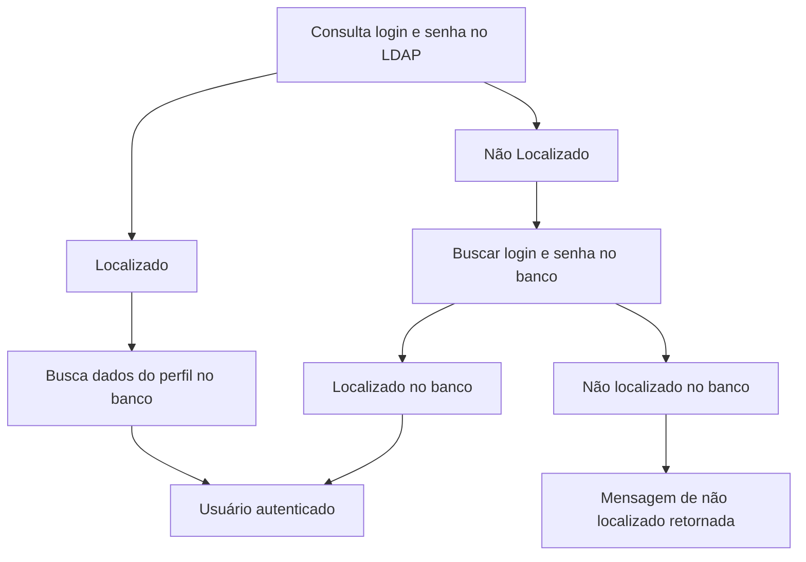

# Sistemas GSI

O projeto Sistemas GSI trata de um conjunto de ferramentas de _Big Data_ para consulta e análise de dados pelo Ministério Público de Minas Gerais e parceiros. Atualmente ele é composto pelos módulos: Áduna e Lins.  
O Áduna é uma plataforma de _Big Data_ desenvolvida para armazenamento, consulta e análise de dados de pessoas físicas e jurídicas.  
O Lins é uma plataforma para análise, controle e fiscalização do patrimônio e contas públicas.

    
    &nbsp;&nbsp;&nbsp;&nbsp;&nbsp;&nbsp;&nbsp;&nbsp;&nbsp;&nbsp;
    
&nbsp;&nbsp;&nbsp;&nbsp;&nbsp;&nbsp;&nbsp;&nbsp;&nbsp;&nbsp;

## Sumário

- [Links de Acesso](#links-de-acesso)
- [Requisitos Mínimos](#requisitos-mínimos)
- [Acesso](#acesso)
- <a href="https://gitlab.com/4mti_solucoes/consulta_gsi/-/blob/homologacao/documentacao/enderecosServidores.md">Endereços Servidores</a>
- <a href="https://gitlab.com/4mti_solucoes/consulta_gsi/-/blob/homologacao/documentacao/desenvolvimento.md">Ambiente de Desenvolvimento</a>
- <a href="https://gitlab.com/4mti_solucoes/consulta_gsi/-/blob/homologacao/documentacao/cargaGSI.md">Carga GSI</a>
- <a href="https://gitlab.com/4mti_solucoes/consulta_gsi/-/blob/homologacao/documentacao/ConsultaGSI.md">Consultas GSI</a>
- <a href="https://gitlab.com/4mti_solucoes/consulta_gsi/-/blob/homologacao/documentacao/testeAduna.md">Teste Geral Áduna</a>
- <a href="https://gitlab.com/4mti_solucoes/consulta_gsi/-/blob/homologacao/documentacao/testeLins.md">Teste Geral Lins</a>
- <a href="https://gitlab.com/4mti_solucoes/consulta_gsi/-/blob/homologacao/documentacao/contigencia.md">Plano de Contigência</a>
- <a href="https://gitlab.com/4mti_solucoes/consulta_gsi/-/blob/homologacao/documentacao/depuracao.md">Depuração</a>
- <a href="https://gitlab.com/4mti_solucoes/consulta_gsi/-/blob/homologacao/documentacao/integracaoContinua.md">Integração contínua</a>
- <a href="https://gitlab.com/4mti_solucoes/consulta_gsi/-/blob/homologacao/documentacaoSistemasGSI.pdf">Documentação Completa</a>

## Links de Acesso

O sistema pode ser acessado em produção nos seguintes endereços:

- <a target="_blank">https://sistemasgsi.mpmg.mp.br/</a>
- <a target="_blank">https://aduna.mpmg.mp.br/</a>
- <a target="_blank">https://lins.mpmg.mp.br/</a>

Em homologação no endereço:

- <a target="_blank">http://sistemasgsi-des.mpmg.mp.br/</a>

## Requisitos Mínimos

Requisitos de Sistema operacional.

- Windows 7 ou mais recente
- Linux  Ubuntu 18.04+ de 64 bits, Debian 10+, openSUSE 15.2+ ou Fedora Linux 32+
- Mac OS X El Capitan 10.11 ou mais recente

Hardware

- Processador intel Pentium 4 ou superior compatível com SSE3
- Memoria Ram: 4GB ou superior

Acesso a rede

- Conexão de internet velocidade de 5 Mbit ou 800kbps ou superior.

Navegador Web

- Mozilla Firefox (versão 58 ou superior)
- Chrome (versão 67 ou superior)
- Safari (verão 11.1 ou superior)

## Acesso

Para acessar o Sistemas GSI, entre em um dos links informados em [Links de Acesso](#links-de-acesso).  
Na página inicial do sistema (Figura 2) o usuário deve realizar o seu login.

  
_Figura 2: Tela de login do sistema para o link https://sistemasgsi.mpmg.mp.br/_

A autenticação de usuários no Sistemas GSI é feita por meio de chamada API, que segue uma sequência de passos a garantir se o usuário está ou não habilitado para acessar o sistema.

O sistema valida o acesso se valendo de duas formas, LDAP (Lightweight Directory Access Protocol), ferramenta de gerenciamento de credenciais do Windows utilizada pelo MPMG e cadastro no banco de dados PostgreSQL para demais usuários, onde as credencias são armazenadas encriptadas pelo algoritmo SHA-1 de 160 bits.  
O primeiro passo: Para os usuários já cadastrados nos sistemas corporativos do MPMG, o acesso é feito com suas credenciais deste. No primeiro acesso, uma entrada na tabela aduna_oltp.usuario será criada com suas credenciais do LDAP. Para os demais usuários, o nome de usuário ou ou email e senha do PostgreSQL deverão ser inseridos.  
O segundo passo: Os dados de acesso são consultado no banco de dados do PostgreSQL, utilizando a tabela aduna_oltp.usuario. Caso o usuário não tenha cadastro, a mensagem de não localizado será retornada.  
Validado o acesso, o sistema verifica se o usuário já confirmou o aceite ao termo de responsabilidade, consultando a tabela aduna_oltp.termo_responsabilidade do PostgreSQL. Caso não tenha ainda aceito, ao se autenticar, ele será redirecionado para a página do termo de responsabilidade, conseguindo navegar nas demais páginas apenas após o aceite.  
O fluxo de validação desta rotina pode ser visto abaixo.  
O diretório onde a rotina de autenticação está localizada é `/var/www/html/consultas_gsi/src/controller/controllerAduna.js`. O método de interesse chama-se logar.

> Obs.: Caso você não possua o cadastro, este deve ser solicitado à algum administrador do sistema.

Os usuário deverão estar previamente associados a um perfil e a um pacote de fontes.  
Ao realizar o login, o usuário será redirecionado para a página de seleção do módulo, como mostra a Figura 3.  
  
_Figura 3: Tela de seleção de sistema_

Todos os eventos relacionados a autenticação estão disponíveis na tela de Logs do Sistema. Existem 5 tipos de acesso, eles são:

- LOGIN: Ao realizar autenticação bem-sucedida;
- LOGOUT: Ao encerrar a sua sessão;
- TENTATIVA DE LOGIN: Ao realizar autenticação mal-sucedida, quaisquer sejam os motivos;
- ACESSO: Ao realizar qualquer consulta bem-sucedida no Áduna ou Lins;
- ERRO: Ao realizar qualquer consulta mal-sucedida no Áduna ou Lins.

### Fluxo de Validação do Login

As informações do LPAD estão descritas no arquivo .env do projeto.
